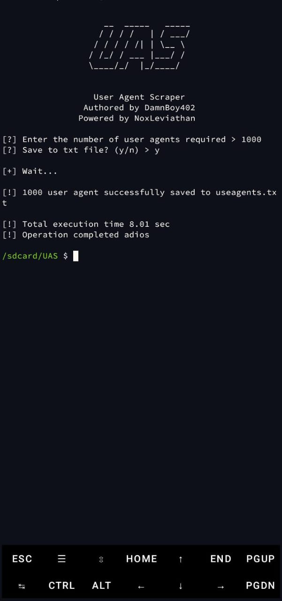

# User Agent Scraper - UAS

## 🔍 About This Tool
**User Agent Scraper** is an advanced tool for collecting the latest User Agents from multiple automated sources. Built with Python, this tool utilizes multithreading technology to enhance data retrieval speed.

## ✨ Key Features
- ✅ Scraping from **10+ different sources**
- ✅ **Multithreading** technology for maximum speed
- ✅ Random User Agent generation with shuffle system
- ✅ Save-to-file text option
- ✅ Real-time execution time display
- ✅ User-friendly CLI interface with stylish banners

## 🖼️ Tool Preview - Y Option


## 🖼️ Tool Preview 2 - N Option


## 🛠 Installation
1. Ensure Python 3.6+ is installed
2. Install dependencies:
```bash
pip install requests beautifulsoup4 pyfiglet
```
3. Clone the repository:
```bash
git clone https://github.com/DamnBoy402/UAS.git
```

## 🚀 Usage Guide
1. Navigate to the project directory:
```bash
cd UAS
```
2. Run the script:
```bash
python uas2.py
```
3. Follow on-screen instructions:
   - Enter the number of User Agents needed
   - Choose file save option (y/n)

## 🤝 Contributing
We welcome contributions! Here's how to contribute:
1. Fork this repository
2. Create a feature branch (`git checkout -b feature/featurename`)
3. Commit your changes (`git commit -m 'Add new feature'`)
4. Push to the branch (`git push origin feature/featurename`)
5. Create a Pull Request

## 🐛 Reporting Issues
Found a bug or issue? Report via:
- Telegram: [@DamnBoy402](https://t.me/DamnBoy404)
- Create an issue on the GitHub repository

## 📜 License
Distributed under MIT License. See [LICENSE](LICENSE) for details, this project is **open source** and free to use.

## 💻 Technologies Used
- Python 3
- Requests
- BeautifulSoup4
- Pyfiglet
- Concurrent.futures

## #️⃣ Support
- [ WSL](https://learn.microsoft.com/en-us/windows/wsl/)
- [ Termux](https://termux.com/)
- [ Kali Linux](https://www.kali.org/)

# Special Thanks To:

- Noxs404  
- ChiroXploit404  
- FkzSec  
- Darkness  
- Leviathan404CyberTeam  
- Always Mikaelz  
- Fem|301  
- YhujinOS  
- Laten Cyber  
- Zull  
- HyperXclic!  
- NoTolerance - Ilham  
- Darkness  
- Lucia  
- Nia  
- TC20  
- Doom3r  
- Zhan  
- Sastra  
- **And all contributors**  

> You are free to recode this tool, but don't forget to include the original developer!  

*Copyright©2025 UAS - UserAgent Scrapper*  
**Respect me as developer!**

## 🛡️ Powered By
**Leviathan404CyberTeam** - A professional cybersecurity team always at the forefront of digital security innovation.

---
Created with ❤️ by **DamnBoy402** - Let's make cybersecurity accessible for everyone!